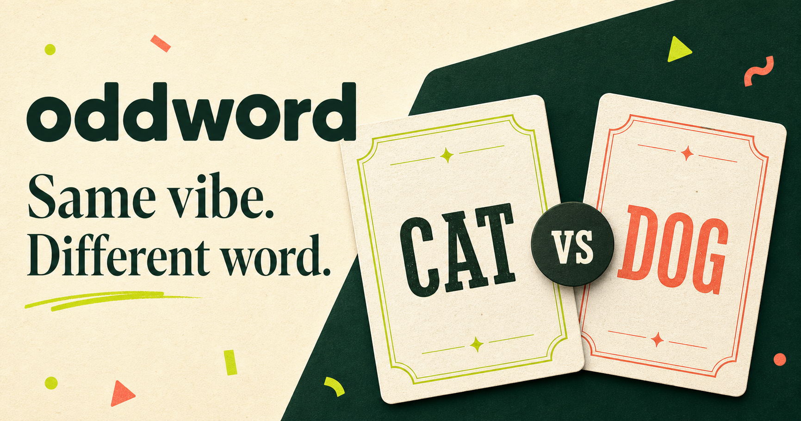
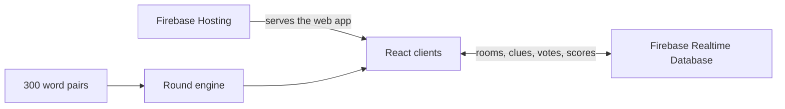

<p align="center">
  
</p>

<h1 align="center">Oddword</h1>

<p align="center">
  A real-time multiplayer party game about clever clues, convincing bluffs, and finding the player with the different word.
</p>

<p align="center">
  <a href="https://oddword-6b124.web.app"><strong>Play Oddword</strong></a>
  ·
  <a href="#how-to-play">How to play</a>
  ·
  <a href="#run-locally">Run locally</a>
</p>

<p align="center">
  
  
  
  
</p>

## The story

Oddword started with a simple conversation while sitting with friends: what if
everyone received the same word except one person—and nobody knew who that
person was?

The next day, that idea became a playable multiplayer game.

## How to play

| Step | What happens |
| --- | --- |
| **1. Create** | A host creates a room, chooses the rules, and shares the five-letter code. |
| **2. Discover** | Most players receive the same secret word. One random player receives a closely related word. |
| **3. Describe** | Players take turns giving exactly one-word clues without saying or revealing their word. |
| **4. Vote** | Everyone votes for the person they think received the odd word. |
| **5. Reveal** | The words, odd player, result, and updated scores are shown to everyone. |

If the majority identifies the odd player, the group wins. Otherwise, the odd
player wins the round.

## Features

- Real-time multiplayer rooms with shareable room codes
- Synchronized clues, voting, reveals, and scoreboards
- Host-selected round count, clue time, voting time, and room size
- Random odd-player selection every round
- Shuffled clue order with a different starting player
- 300 balanced word pairs across 15 everyday categories
- Mobile-first responsive interface and animated transitions
- Local demo mode when Firebase is not configured
- Free production deployment through Firebase Hosting

## Built for fair rounds

The word database favors familiar pairs such as `Cat / Dog`, `Coffee / Tea`,
and `Beach / Pool`. Each pair is close enough to produce overlapping clues but
different enough to leave room for deduction.

Used pairs are tracked so the same matchup does not immediately repeat, while
both the odd player and clue order are randomized each round.

## Architecture



| Layer | Technology |
| --- | --- |
| Interface | React 19, TypeScript, Tailwind CSS |
| Multiplayer state | Firebase Realtime Database |
| Hosting | Firebase Hosting |
| Build tooling | Vite and vinext |
| Game content | Reusable TypeScript word-pair database |

## Run locally

### Prerequisites

- Node.js 22.13 or newer
- A Firebase project with Realtime Database enabled

### 1. Install dependencies

```bash
npm install
```

### 2. Create your local environment file

```bash
cp .env.example .env.local
```

Add your Firebase web-app configuration to `.env.local`:

```env
NEXT_PUBLIC_FIREBASE_API_KEY=
NEXT_PUBLIC_FIREBASE_AUTH_DOMAIN=
NEXT_PUBLIC_FIREBASE_DATABASE_URL=
NEXT_PUBLIC_FIREBASE_PROJECT_ID=
NEXT_PUBLIC_FIREBASE_STORAGE_BUCKET=
NEXT_PUBLIC_FIREBASE_MESSAGING_SENDER_ID=
NEXT_PUBLIC_FIREBASE_APP_ID=
```

### 3. Configure Firebase

1. Create a Firebase web app.
2. Enable Realtime Database.
3. Apply the rules from `firebase.database.rules.json`.
4. Add your web-app values to `.env.local`.

### 4. Start the game

```bash
npm run dev
```

Open the local URL shown in your terminal. Without Firebase values, Oddword
starts in demo mode so the interface can still be explored.

## Commands

| Command | Purpose |
| --- | --- |
| `npm run dev` | Start the development server |
| `npm run build` | Create the Sites-compatible production build |
| `npm run build:firebase` | Create the Firebase Hosting build |
| `npm run test` | Build the app and run the test suite |
| `npm run lint` | Run ESLint |

## Project structure

```text
app/
├── page.tsx                 # Game screens and client flow
├── globals.css              # Responsive visual system
└── layout.tsx               # Page metadata and root layout
lib/
├── firebase.ts              # Real-time multiplayer data layer
└── word-pairs.ts            # 300 categorized word pairs
tests/                       # Render and configuration tests
firebase.database.rules.json # Realtime Database rules
firebase.json                # Firebase Hosting configuration
```

## Security

- `.env.local` and all environment variants are excluded from Git.
- Only the empty `.env.example` template is tracked.
- Firebase CLI state, private keys, credentials, and service-account files are
  ignored.
- Never place Firebase Admin SDK credentials in client-side code.
- Review and adapt the database rules before using the project for a different
  production environment.

## Contributing

Ideas, bug reports, and pull requests are welcome. Please run `npm run test`
before submitting a change.

---

<p align="center">
  Built from a game-night idea into a real-time game for friends.
</p>
